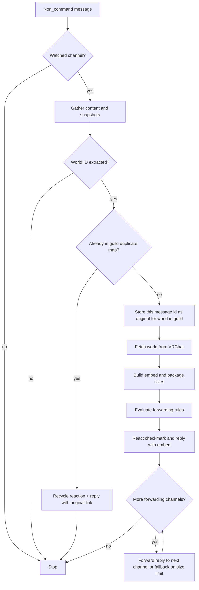
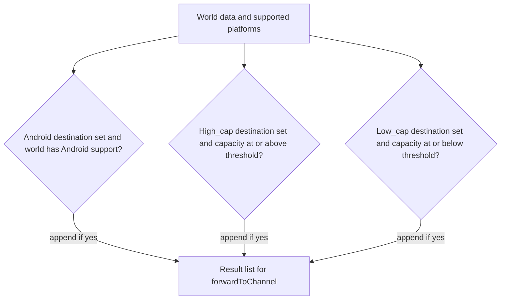
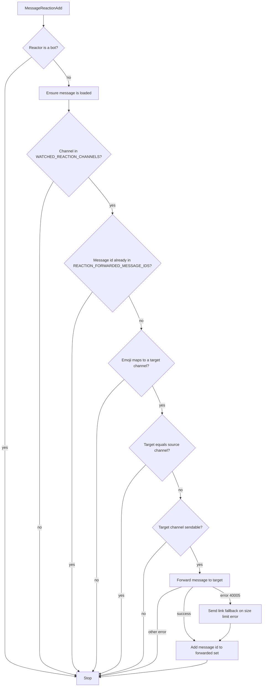
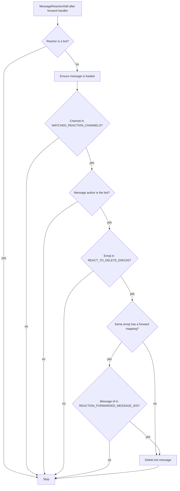

# VRC World Tagger Bot — Manual

This manual covers everything the bot does: how it detects and processes VRChat world links, how reaction-based forwarding and cleanup work, and a full command reference.

---

## 1. World Link Processing

When someone posts a message in a **watched** channel and the text is not a bot command, the bot processes it for VRChat world links.

### Flow

1. The bot checks if the channel is in the watched-channel list (`WATCHED_CHANNELS`).
2. It gathers text from the message body and from **forwarded message snapshots** (so links inside forwards are visible).
3. It extracts a VRChat world ID from that text (direct links, Twitter/X posts, etc.).
4. It runs **per-guild duplicate handling**: if this world was already introduced in the guild, the bot reacts (♻️) and replies with a link to the original message; otherwise it records this message as the canonical source for that world in the guild.
5. For a **new** occurrence, it fetches world data from VRChat, builds an embed, replies in the channel, then may **forward** the bot's reply to zero or more configured channels based on Android support, high capacity, and low capacity rules.

A single world can satisfy **multiple** forwarding rules at once; each match adds another destination. Thresholds come from `FORWARD_PLAYER_COUNT_THRESHOLD` (default 40) and `LOW_CAPACITY_THRESHOLD` (default 20); see the root [README](../README.md) configuration table.

### Duplicate handling

A key `{worldId}-{guildId}` in `PROCESSED_WORLDS_WITH_ORIGINAL_MESSAGE_ID` tracks which worlds have been seen in each guild.

- **Duplicate found**: the bot adds a ♻️ reaction and replies with a link to the original message. Users can react with ♻️ on that duplicate message to force a refetch.
- **New world**: the bot stores the current message ID as the original and continues processing.

Crawl history can also call duplicate logic in **silent** mode (no user-facing reply).

### Automatic forwarding rules

Three independent conditions are checked in order. Each match appends a destination channel to the forwarding list (any combination is possible, including all three at once).

| Rule | Condition |
|------|-----------|
| Android | Android destination channel is set **and** the world has Android/Quest support |
| High capacity | High-capacity destination channel is set **and** capacity ≥ `FORWARD_PLAYER_COUNT_THRESHOLD` (default 40) |
| Low capacity | Low-capacity destination channel is set **and** capacity ≤ `LOW_CAPACITY_THRESHOLD` (default 20) |

If Discord rejects the forward due to size (HTTP 40005), the bot sends a link to the original message plus the embed in the target channel instead.

---

## 2. Reaction Forwarding

Reaction forwarding lets admins watch specific channels and map emojis to destination channels. When a non-bot user adds a configured emoji to a message in a watched channel, the bot forwards that message to the mapped channel. Useful for "save to channel" workflows.

### Setup

1. Watch one or more source channels: `.watchReacts #source-channel` (repeat for multiple channels).
2. Map an emoji to a destination: `.forwardReact <emoji> #destination-channel` (e.g. `.forwardReact 📌 #saved`).
3. Verify with `.listReacts`.

### Handler order

On `MessageReactionAdd`, handlers run in this order:

1. **Reaction forward** (`onReactionForward`) — forwards the message if the emoji is mapped.
2. **React to delete** (`onReactionToDelete`) — deletes the bot's message if the emoji matches the delete list.
3. **Force refetch** (`onReactionForceRefetch`) — ♻️ reaction on user messages in watched world channels triggers a refetch for duplicates (separate feature).

If an emoji is both a **forward** mapping and a **delete** mapping, forwarding runs first. React-to-delete only deletes **bot** messages and only after the forward is recorded.

### Reaction forward flow

### React to delete

In channels registered with `.watchReacts`, registered emojis delete **only messages authored by the bot** when a non-bot user reacts with that emoji.

If the emoji is **not** used for forwarding, the bot message is deleted as soon as the emoji matches the delete list.

### Quality channel tracking

When a destination channel is registered with `.setQualityChannel`, the bot automatically records the world's **quality** (`good` or `bad`) in the database whenever a message is reaction-forwarded to that channel.

- Only one channel per quality at a time. Setting a new one replaces the previous.
- Use `.clearQualityChannel good|bad` to stop tracking.

### Key behaviors

| Behavior | Detail |
|----------|--------|
| Watched channels only | A forward triggers only when the message is in a channel added with `.watchReacts`. |
| One forward per message | Only the first matching reaction forwards the message. Subsequent reactions on the same message are ignored. |
| Same-channel safeguard | If the target channel equals the source channel, the bot does not forward (avoids infinite loops). |
| Old messages | Works on messages sent before the bot was online. Uncached messages are fetched when the reaction event fires. |
| Large messages | If Discord rejects the forward (HTTP 40005), the bot sends a link to the original message in the target channel instead. |

### Emoji support

Unicode emojis (e.g. 📌) and Discord custom emojis (`<:name:id>`) are both supported. When removing a mapping with `.removeReact`, use the same emoji form as when you added it, or remove by **1-based index** from `.listReacts` (e.g. `.removeReact 1`).

### Stored data

Configuration is stored in `db.json`:

- **REACTION_FORWARD_CHANNELS** — Emoji → destination channel ID mappings.
- **WATCHED_REACTION_CHANNELS** — Channel IDs watched for reaction forwarding.
- **REACTION_FORWARDED_MESSAGE_IDS** — Message IDs that have already been forwarded.
- **REACT_TO_DELETE_EMOJIS** — Emojis that trigger deletion of the bot's messages.

---

## 3. Command Reference

### Usage notes

- Send commands as normal messages in a **text channel** the bot can read.
- **Admin commands** require your Discord user ID in the `ADMIN_ID` environment variable (comma-separated). Non-admin users are **silently ignored** on admin commands.
- When a command needs a channel, **mention it** with `#`. The bot uses the **first channel mention**.
- **Routing note:** `.exportFull` is matched before `.export`, so messages must start with `.exportFull` for the full export.

### Opt out / opt in (any user, not bots)

| Command | Admin | Description |
|---------|-------|-------------|
| `.ignoreMe` | No | Adds you to the ignore list; the bot stops processing your messages and reactions until you opt back in. |
| `.unignoreMe` | No | Removes you from the ignore list. While ignored, this is the **only** command the bot still handles for you. |

### Channel watching

| Command | Admin | Description | Usage |
|---------|-------|-------------|-------|
| `.watch` | Yes | Watch a channel for VRChat world links (embeds, duplicate tracking, automatic forwarding). | `.watch #channel` |
| `.unwatch` | Yes | Stop watching a channel for world links. | `.unwatch #channel` |

### Automatic forwarding (world criteria)

Each command sets **one** destination for that rule. A single world can match several rules and be forwarded to **several** channels in one pass.

| Command | Admin | Description | Usage |
|---------|-------|-------------|-------|
| `.forwardAndroid` | Yes | Forward worlds with Android/Quest support to a channel. | `.forwardAndroid #channel` |
| `.forwardMaxSlots` | Yes | Forward high-capacity worlds (capacity ≥ `FORWARD_PLAYER_COUNT_THRESHOLD`, default 40). | `.forwardMaxSlots #channel` |
| `.forwardLowCap` | Yes | Forward low-capacity worlds (capacity ≤ `LOW_CAPACITY_THRESHOLD`, default 20). | `.forwardLowCap #channel` |
| `.clearForwardingChannels` | Yes | Clear all automatic forwarding destinations (Android, high-cap, low-cap). Does **not** change watched channels or reaction settings. | `.clearForwardingChannels` |

### Reaction forwarding and cleanup

See [§2. Reaction Forwarding](#2-reaction-forwarding) for setup and behavior details.

| Command | Admin | Description | Usage |
|---------|-------|-------------|-------|
| `.watchReacts` | Yes | Allow reactions in a channel to trigger emoji→channel forwarding (after mapping with `.forwardReact`). | `.watchReacts #channel` |
| `.unwatchReacts` | Yes | Stop watching a channel for reaction-based forwarding. | `.unwatchReacts #channel` |
| `.forwardReact` | Yes | Map an emoji to a destination; in watched react channels, that reaction forwards the message (once per message). | `.forwardReact <emoji> #channel` |
| `.listReacts` | Yes | List channels with `.watchReacts`, emoji→channel mappings, and react-to-delete emojis (with indices for removal). | `.listReacts` |
| `.removeReact` | Yes | Remove a forward mapping by emoji or by **1-based** index from `.listReacts`. | `.removeReact <emoji or index>` |
| `.addDeleteReact` | Yes | Register an emoji so reacting with it on **the bot's messages** deletes them (in `.watchReacts` channels). | `.addDeleteReact <emoji>` |
| `.removeDeleteReact` | Yes | Remove a react-to-delete emoji by emoji or **1-based** index (under **React to delete** in `.listReacts`). | `.removeDeleteReact <emoji or index>` |
| `.setQualityChannel` | Yes | Mark a channel as a quality-tracking destination. When a world is reaction-forwarded to that channel, the bot records its quality (`good` or `bad`) in the database. Only one channel per quality at a time. | `.setQualityChannel <good|bad> #channel` |
| `.clearQualityChannel` | Yes | Clear the quality-channel assignment for `good` or `bad`. After clearing, worlds forwarded to that channel won't have quality recorded. | `.clearQualityChannel <good|bad>` |

### World data and history

| Command | Admin | Description | Usage |
|---------|-------|-------------|-------|
| `.export` | No | Export a CSV of processed world IDs and URLs (no live VRChat API call per world). | `.export` |
| `.exportFull` | Yes | Export a detailed CSV with live VRChat API data per world; rate-limited and heavier. | `.exportFull` |
| `.crawlHistory` | Yes | Scan a channel's history for world links. Supports three modes: **discover** (default, finds new worlds with duplicate logic), **`--tags`** (rebuilds tags and `source_content` from history for already-discovered worlds), **`--quality good\|bad`** (assigns a quality rating to already-discovered worlds). Crawls are resumable and can be cancelled by reacting with ❌ on the progress message. | `.crawlHistory #channel [--tags \| --quality good\|bad]` |
| `.crawlStatus` | No | Show crawl progress or completion for a channel. | `.crawlStatus #channel` |

### Maintenance

| Command | Admin | Description | Usage |
|---------|-------|-------------|-------|
| `.stats` | No | Show bot statistics (**only** in channels that are watched with `.watch`). | `.stats` |
| `.remove` | Yes | In a **watched** channel, clear duplicate tracking for a world whose link appears in the message so it can be treated as new again in this guild. Does not unwatch or delete forwarded copies. | `.remove <world URL>` |
| `.die` | Yes | Shut down the bot process gracefully. | `.die` |

### Anything that is not a command

Messages that do **not** start with a known command prefix are handled as normal content: in watched channels, the bot runs world-link detection, embeds, duplicate handling, and forwarding as described in [§1. World Link Processing](#1-world-link-processing).

---

## 4. Related

- [README](../README.md) — installation, environment variables, and scripts.