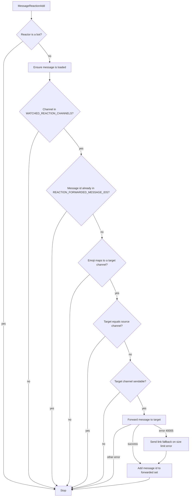
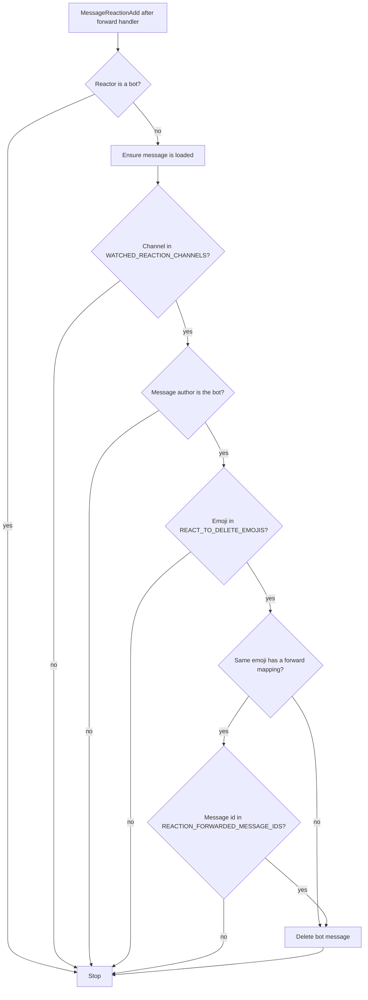

# Reaction forwarding

## Overview

Reaction forwarding lets admins watch specific channels and map emojis to destination channels. When someone (non-bot) adds a configured emoji to a message in a watched channel, the bot forwards that message to the mapped channel. Useful for "save to channel" workflows (e.g. react with a bookmark emoji to send a copy to an archive channel).

## Prerequisites

All reaction-forwarding commands require admin (user ID in `ADMIN_ID`). No special Discord permissions beyond what the bot already needs.

## Setup

1. Watch one or more source channels: `.watchReacts #source-channel` (repeat for multiple channels).
2. Map an emoji to a destination: `.forwardReact <emoji> #destination-channel` (e.g. `.forwardReact 📌 #saved`).
3. Verify with `.listReacts`.

## Commands reference

| Command | Description |
|---------|-------------|
| `.watchReacts #channel` | Watch a channel for reaction-based forwarding. Reactions in this channel can trigger forwards. |
| `.unwatchReacts #channel` | Stop watching a channel for reaction forwarding. |
| `.forwardReact <emoji> #channel` | Map an emoji to a channel. When someone reacts with this emoji in a watched channel, the message is forwarded to the target channel. |
| `.listReacts` | List forwarding mappings and react-to-delete emojis (with indices for removal). |
| `.removeReact <emoji or index>` | Remove the forwarding mapping for an emoji, or by 1-based index as shown under **Forwarding** in `.listReacts`. |
| `.addDeleteReact <emoji>` | Register an emoji that deletes **the bot’s messages** in `.watchReacts` channels when someone reacts with it. |
| `.removeDeleteReact <emoji or index>` | Remove a react-to-delete emoji, or by 1-based index under **React to delete** in `.listReacts`. |

## Handler order

On `MessageReactionAdd`, [`bot.ts`](../src/bot.ts) runs handlers in this order:

1. [`onReactionForward`](../src/events/messageReactionAdd/onReactionForward.ts)
2. [`onReactionToDelete`](../src/events/messageReactionAdd/onReactionToDelete.ts)
3. [`onReactionForceRefetch`](../src/events/messageReactionAdd/onReactionForceRefetch.ts) (recycle reaction on user messages in watched world channels; separate feature)

So if an emoji is both a **forward** mapping and a **delete** mapping, the forward runs first. React-to-delete only deletes **bot** messages and, when the emoji also forwards, only after that message ID was recorded as forwarded (see diagram below).

## Reaction forward flow

Implementation: [`onReactionForward`](../src/events/messageReactionAdd/onReactionForward.ts). Emoji lookup uses [`getEmojiKey` / `resolveForwardTargetChannelId`](../src/utils/discord/reactionEmoji.ts) (Unicode name or custom `<:name:id>` form, with a `:name:` fallback for custom emojis).

## React-to-delete

In channels registered with `.watchReacts`, you can register emojis that delete **only messages authored by the bot** when a non-bot user reacts with that emoji. Commands:

- **`.addDeleteReact <emoji>`** — Saves the emoji to `REACT_TO_DELETE_EMOJIS`. The bot confirms that in watched react channels, reacting on the bot’s messages with this emoji deletes them, and that if the same emoji is used for `.forwardReact`, forwarding is recorded before delete logic applies.
- **`.removeDeleteReact <emoji>`** or **`.removeDeleteReact <index>`** — Removes one entry; use indices from `.listReacts` under **React to delete**.

If the emoji is **not** used for forwarding, `alsoFwd` is effectively false and the bot message is deleted as soon as the emoji matches the delete list (still only in watched react channels, still only bot messages).

## How it works

- **Watched channels only** — A forward triggers only when the message is in a channel that has been added with `.watchReacts`. Reactions in other channels are ignored.
- **One forward per message** — Only the first reaction that matches a configured emoji forwards the message. The message ID is stored so the same message is never forwarded again, even if more people react with the same emoji.
- **Same-channel safeguard** — If the target channel is the same as the channel containing the message, the bot does not forward. This avoids infinite loops when someone reacts to an already-forwarded message in the destination channel.
- **Old messages** — Works on messages sent before the bot was online. Uncached messages are fetched when the reaction event fires.
- **Large messages** — If Discord rejects the forward due to message size (e.g. attachments over the limit), the bot sends a link to the original message in the target channel instead.

## Emoji support

Unicode emojis (e.g. 😀, 📌) and Discord custom emojis are supported. When removing a mapping with `.removeReact`, use the same emoji form as when you added it (e.g. the exact emoji string). If the emoji was deleted or is hard to type, you can remove by index instead: `.listReacts` shows a number for each mapping; use `.removeReact 1`, `.removeReact 2`, etc.

## Stored data

Configuration is stored in `db.json`:

- **REACTION_FORWARD_CHANNELS** — Mapping of emoji (as stored by the bot) to destination channel IDs.
- **WATCHED_REACTION_CHANNELS** — List of channel IDs that are watched for reaction forwarding.
- **REACTION_FORWARDED_MESSAGE_IDS** — Message IDs that have already been forwarded (so each message is only forwarded once).
- **REACT_TO_DELETE_EMOJIS** — Emojis that trigger deletion of the bot’s messages in watched react channels (see [React-to-delete](#react-to-delete)).

You do not need to edit these by hand for normal use.
