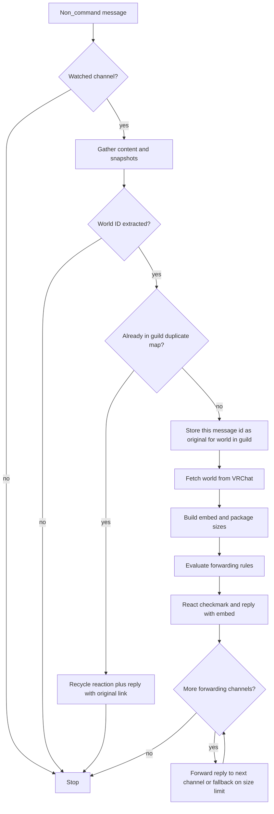
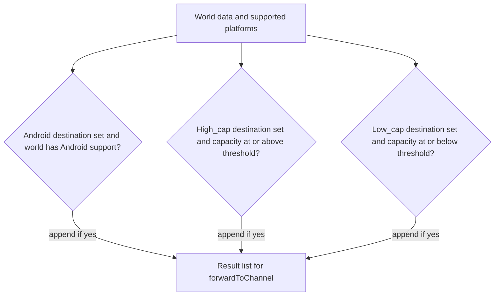

# World link processing

This document describes what happens when someone posts a message in a **watched** channel and the text is not a bot command. The implementation lives in [`watchForVRCWorldLinks`](../src/events/messageCreate/watchForVRCWorldLinks/index.ts) and related modules.

## Overview

1. The bot checks whether the message’s channel is in the watched-channel list (`WATCHED_CHANNELS`).
2. It gathers text from the message body and from **forwarded message snapshots** (so links inside forwards are visible).
3. It extracts a VRChat world ID from that text (direct links, Twitter/X, etc.).
4. It runs **per-guild duplicate handling**: if this world was already introduced in the guild, the bot reacts and replies with a link to the original message; otherwise it records this message as the canonical source for that world in the guild.
5. For a **new** occurrence, it fetches world data from VRChat, builds an embed, replies in the channel, then may **forward** the bot’s reply to zero or more configured channels based on Android support, high capacity, and low capacity rules.

A single world can satisfy **multiple** forwarding rules at once; each match adds another destination. Thresholds come from `FORWARD_PLAYER_COUNT_THRESHOLD` (default 40) and `LOW_CAPACITY_THRESHOLD` (default 20); see the root [README](../README.md) configuration table.

## End-to-end flow

## Duplicate handling

[`checkAndHandleDuplicate`](../src/events/messageCreate/watchForVRCWorldLinks/duplicateHandler/index.ts) uses a key `{worldId}-{guildId}` in `PROCESSED_WORLDS_WITH_ORIGINAL_MESSAGE_ID`.

- If a value already exists, the world is treated as a **duplicate**: the bot adds a recycle reaction and replies with a short message pointing at the stored message ID (users can use the recycle reaction on that duplicate message to force a refetch; see reaction handlers in [`bot.ts`](../src/bot.ts)).
- If no value exists, the bot **writes** the current message ID as the original for that world in this guild and continues processing.

Crawl history can call the same duplicate logic in **silent** mode (no user-facing reply).

## Automatic forwarding rules

[`getForwardingChannels`](../src/events/messageCreate/watchForVRCWorldLinks/forwarding/index.ts) evaluates three **independent** conditions in order and **pushes** each match onto the same list (so many combinations are possible, including all three at once).

The checks are: Android forwarding channel plus `hasAndroidSupport`, player-count forwarding channel plus capacity ≥ `FORWARD_PLAYER_COUNT_THRESHOLD`, low-capacity forwarding channel plus capacity ≤ `LOW_CAPACITY_THRESHOLD`.

[`forwardToChannel`](../src/events/messageCreate/watchForVRCWorldLinks/forwarding/index.ts) forwards the **bot’s reply message**. If Discord rejects the forward due to size (HTTP 40005), the bot sends a link to the original message plus the embed in the target channel instead.

## Related commands

- **`.watch` / `.unwatch`** — add or remove channels from world-link watching.
- **`.forwardAndroid` / `.forwardMaxSlots` / `.forwardLowCap` / `.clearForwardingChannels`** — configure or clear the destinations used in the forwarding step above.
- **`.remove`** — clears the duplicate-tracking entry for a world in the current guild when run from a watched channel with a parsable world link in the message (does not remove forwards already sent).
